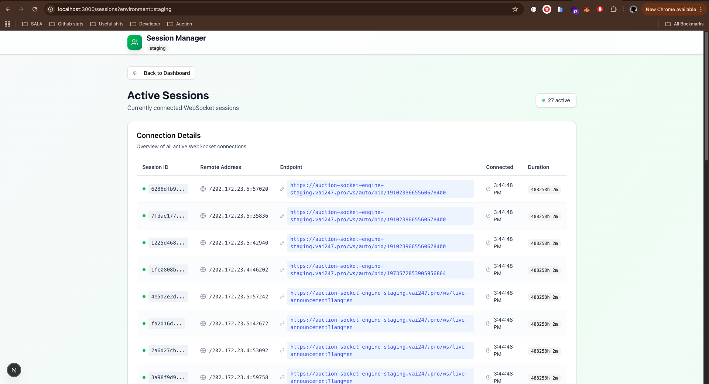

# WebSocket Monitoring Dashboard

> Real-time WebSocket monitoring dashboard built with **Next.js** and **Spring Boot**, providing live statistics, active sessions, and event streams. Supports multiple environments (local, dev, staging, uat).

## Features

* **Real-time Dashboard**: View total connections, messages, and last update timestamp.
* **Active Sessions**: Monitor all connected WebSocket sessions.
* **Event Stream**: Live streaming of events including connection changes, messages sent/received, and Redis messages.
* **Environment Selection**: Switch between multiple environments (`local`, `dev`, `staging`, `uat`) for monitoring.
* **Filtering & JSON Preview**: Filter events by type, endpoint, or session ID with nicely formatted JSON previews.
* **Responsive UI**: Mobile-friendly and modern layout using Tailwind CSS.

## Screenshots




## Tech Stack

* **Frontend**: Next.js 13 (App Router), React, Tailwind CSS
* **Backend**: Spring Boot, Spring WebFlux
* **Real-time Communication**: Server-Sent Events (SSE)
* **Environment Management**: Query parameter `?environment=<env>` and `.env` variables

## Getting Started

### Prerequisites

* Node.js >= 18
* npm or yarn
* Java 17+
* Spring Boot application running with monitoring endpoints:

```
GET    /api/monitoring/stats
GET    /api/monitoring/sessions
GET    /api/monitoring/events          (SSE)
GET    /api/monitoring/stats/stream   (SSE)
```

### Setup Frontend

1. Clone the repository:

```bash
git clone https://github.com/yourusername/websocket-monitor.git
cd websocket-monitor
```

2. Install dependencies:

```bash
npm install
# or
yarn install
```

3. Create `.env.local`:

```env
NEXT_PUBLIC_API_BASE_URL_LOCAL=http://localhost:8080
NEXT_PUBLIC_API_BASE_URL_DEV=https://dev.example.com
NEXT_PUBLIC_API_BASE_URL_STAGING=https://staging.example.com
NEXT_PUBLIC_API_BASE_URL_UAT=https://uat.example.com
```

4. Run the development server:

```bash
npm run dev
# or
yarn dev
```

The dashboard will be available at `http://localhost:3000`.

### Usage

1. Open the app and select an environment to monitor.
2. Navigate between:

   * **Dashboard**: Overview of connections and messages.
   * **Sessions**: List of all active WebSocket sessions.
   * **Events**: Live streaming of events with filtering.
3. Use the **“Switch Environment”** button to switch environments without restarting.

### Event Types

The dashboard handles the following SSE event types:

* `CONNECTION_OPENED`
* `CONNECTION_CLOSED`
* `MESSAGE_SENT`
* `MESSAGE_RECEIVED`
* `REDIS_MESSAGE`

### Folder Structure

```
.
├─ app/                  # Next.js pages
│  ├─ dashboard/         # Dashboard page
│  ├─ events/            # Events page
│  └─ sessions/          # Sessions page
├─ lib/
│  └─ api.ts             # API & SSE helpers
├─ public/
├─ styles/
└─ .env.local
```
